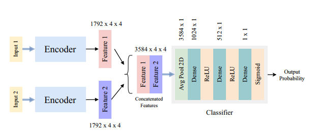

# Image Similarity Matching

MLMI12 - Computer Vision Mini Project. (<a href="report\CV_Mini_Project_Report.pdf"> Report </a>)

Training a neural network to perform image similarity matching on the Tiny Imagenet dataset. Given two images identify whether they belong to the same class or different classes.

## Methods

#### Multiclass Classification

Classify each image separately and check whether the classes match.

#### Multiclass Features with Cosine Similarity
Instead of getting the final class from the network, take the feature embeddings and calculate the cosine similarity between them. If the similarity is above a threshold, then the images are considered to be similar.

#### Siamese Network with Triplet Loss
Train a siamese network with triplet loss. The network takes in two images and outputs the feature embeddings. The triplet loss is calculated between the anchor, positive and negative images. 

#### End-to-End Binary Classifier
Train a network end-to-end to provide binary classes for either similar or dissimal. 

## Results

Seen-Seen : Both image classes were seen during training
Seen-Unseen : One image class was seen during training and the other was unseen
Unseen-Unseen : Both image classes were unseen during training
